# Disc-type glass insulators absence detection

Team name: NeuroEye  
Team members: Edgar Kaziakhmedov, Denis Koposov

## Introduction

The reliability of electrical networks depends on the presence and condition of insulators. The objective is to create an algorithm capable of automatically detecting cases where the glass insulator is missing in the strings of disc-type insulators based on RGB images.  

In the course of this competition, we:
* Gathered a new dataset featuring instances of power towers with absent glass insulators, and pre-processed it to meet our needs
* Manually labeled the dataset to precisely mark the locations of missing insulation using bounding boxes
* Created a detection algorithm employing a fully supervised end-to-end approach
* Evaluated our solution on unseen data to validate its effectiveness
* Modified the suggested pipeline to cater to high-resolution images captured on UAVs

## Installation

Install virtuenv package for python:
```sh
pip3 install virtualenv
```

Create new virtual environment and activate it:
```sh
python3 -m venv ~/kaggle_env
. ~/kaggle_env/bin/activate
```

Install required python packages:
```sh
pip3 install -r requirements.txt
```

## Model weights

Download [the model weights](https://drive.google.com/file/d/1gweLmrbDAfyAiRBXGQC2RS2wiYdlCJ3f/view?usp=sharing) from Google Drive and move the unzipped folder **models** to the same directory as your source code.

## Solution

In order to solve the problem, we employ off-the-shelf YOLOv8x architecture from [Ultralytics](https://docs.ultralytics.com/), initially pre-trained and subsequently fine-tuned on our specific dataset, which consists of a single class. Network is trained on images size of 640x640 which are subjected to a range of augmentations to enhance model robustness.  

Throughout the training process,we configure a batch size of 16, utilizing gradient accumulation to effectively achieve a batch size equivalent to 64. For a comprehensive list of hyper-parameters employed in the training, please refer to [config file](configs/train/yolov8x_adamw_best.yaml).  

For evaluation, we utilize [SAHI tiled inference library](https://docs.ultralytics.com/guides/sahi-tiled-inference/#introduction-to-sahi) designed to enhance the detection performance, especially for small objects. The tiled inference process involves partitioning images into tiles of 640x640 with a specified overlapping factor. Predictions from each tile are subsequently post-processed to merge overlapping boxes and eliminate extraneous detections.

We test different post-processing parameters for tile detection to obtain the most visually convincing results. Below, we present some outcomes to highlight the significance of these parameters:

|   | parameters | mAP50, soft | mAP50, hard |
|:-:|--:|:-:|:-:|
| 1 | conf=0.5, PPMM=IOU, PPMT=0.5, PPT=GREEDYNMM | 0.793 | 0.713 |
| 2 | conf=0.7, PPMM=IOU, PPMT=0.5, PPT=GREEDYNMM | 0.887 | 0.915 |
| 3 | conf=0.5, PPMM=IOS, PPMT=0.7, PPT=NMS | 0.905 | 0.821 |
| 4 | conf=0.7, PPMT=IOS, PPMT=0.7, PPT=NMM | 0.875 | 0.913 |
| 5 | conf=0.5, PPMT=IOS, PPMT=0.7, PPT=NMM, PS=0.1 | **0.905** | **0.938** |

Notes: mAP50 is computed over test set, PPMM - post-process match metric, PPMT - post-process match threshold, PPT - post-process type, conf - initial confidence threshold, PS - bounding box post-shrink factor

## Evaluation

To run prediction script on images located in DATA_DIR directory:

```sh
python3 main.py DATA_DIR
```

The script produces two folders: **predictions** and **submissions**. In the predictions folder, you'll find images with the generated predictions available for visual inspection. Meanwhile, the submissions folder contains a NeuroEye.csv file where predictions are exported in tabular format.

## Data collection

The most labor-intensive and crucial phase involves data collection. We compile images of faulty insulators from diverse sources, closely inspecting each one to ensure quality standards and manually adding annotations. For source #5, due to limited access to imagestock data, we expand the dataset by artificially introducing defects using the content-aware fill tool in Photoshop, it helps significantly increase source diversity. 

To prepare dataset for training, we divide all images into tiles of sizes 640x640, 1000x1000, and 1200x1200, ensuring each tile contains at least one object of interest. Finally, all tiles are resized to 640x640.  Additionally, to minimize false positives, we incorporate background images into the dataset. 

We summarize dataset information after pre-processing in the table below:

|   | dataset | images | examples |
|:-:|--:|:-:|:-:|
| 1 | [Broken-glass-insulator](https://universe.roboflow.com/deep-learning-wpmkc/broken-glass-insulator) | 49 | 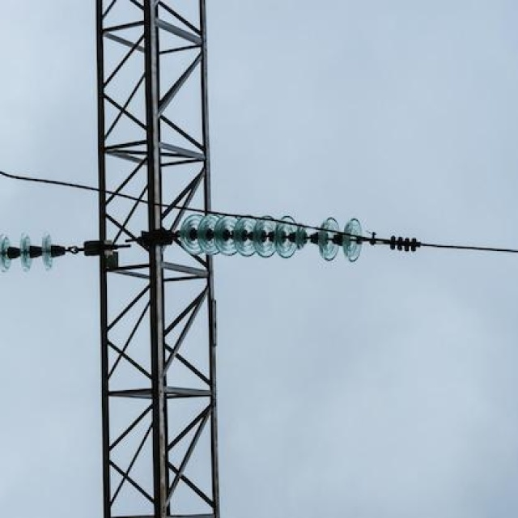 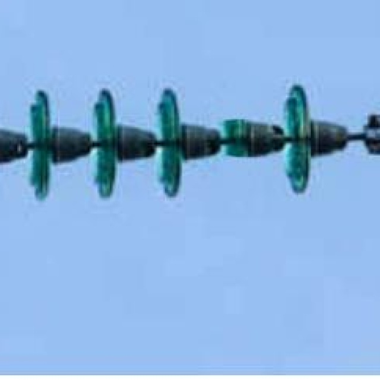 |
| 2 | [cach-dien-thuy](https://universe.roboflow.com/osu/cach-dien-thuy) + [su110kv_broken-sgwz3](https://universe.roboflow.com/osu/su110kv_broken-sgwz3) | 247 | 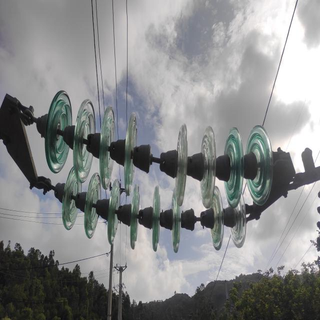 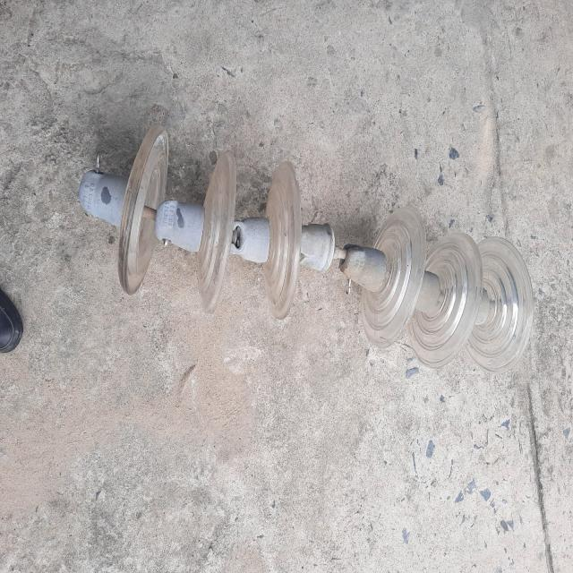 |
| 3 | [insulator-defect-detection](https://datasetninja.com/insulator-defect-detection#download) | 23 | 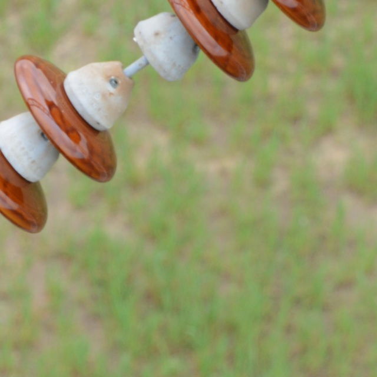 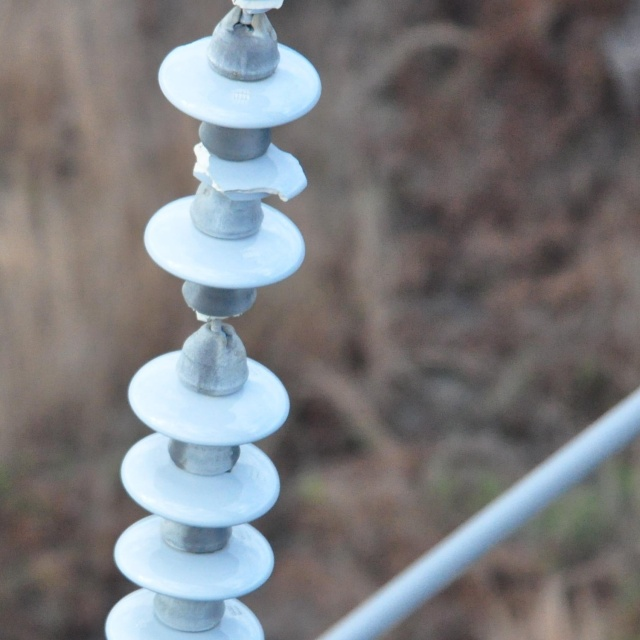 |
| 4 | Testing data (only first 36 images) | 55 | 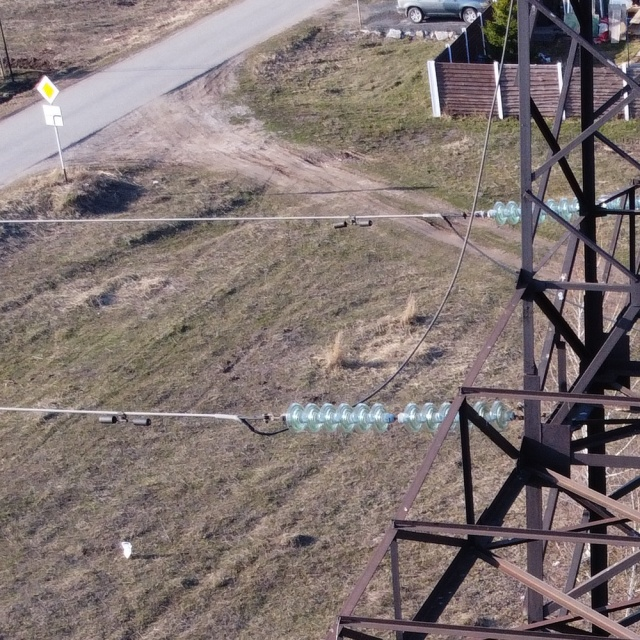 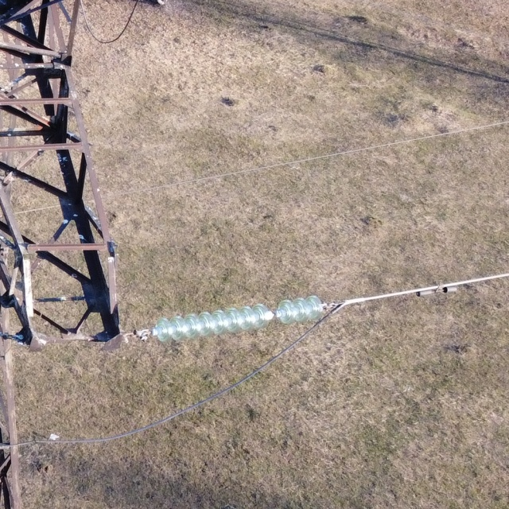 |
| 5 | ShutterStock.com | 50 | 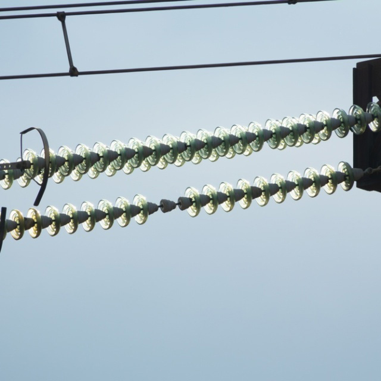 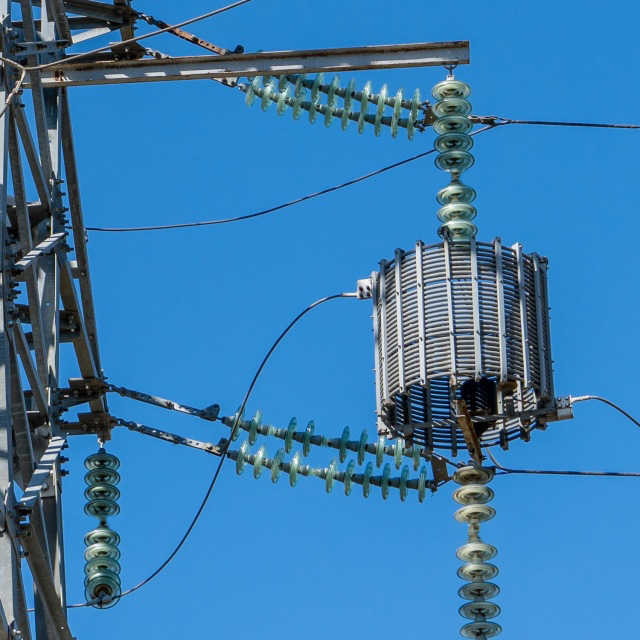 |
| 6 | Searching with Yandex/Google | 23 | 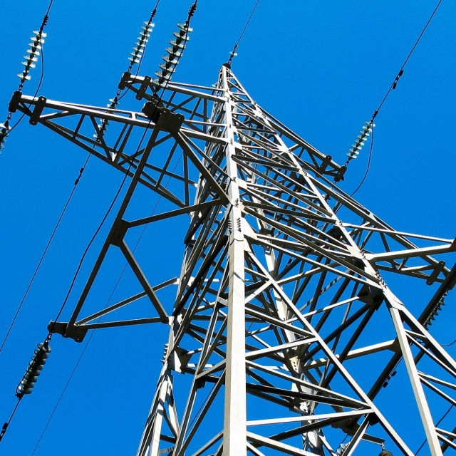 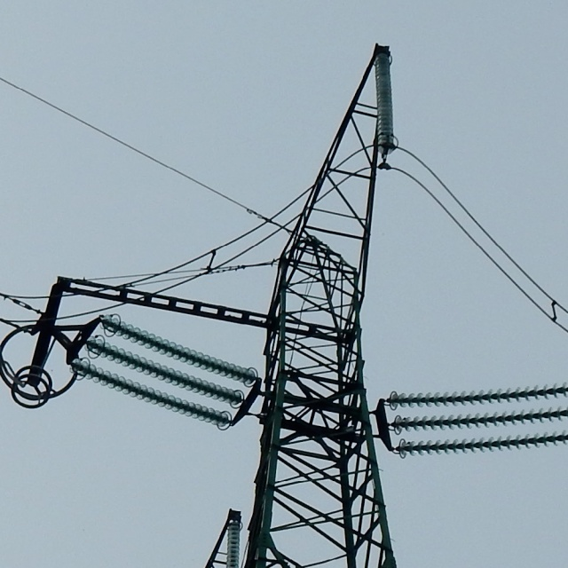 |
| 7 | Images of Moscow power lines | 355 | 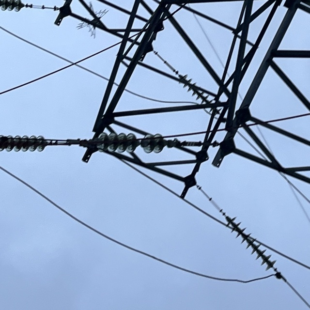 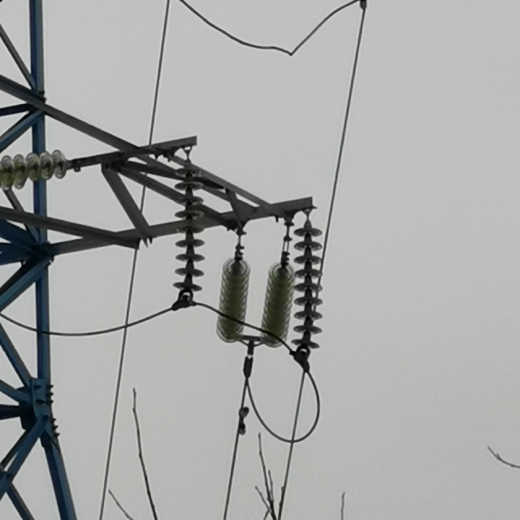 |
|   | Total | **802** | |

After consolidating the data, we perform a shuffle of the images and then proceed to split them into an 80/20 ratio for training and validation, respectively. Notably, we designate the most recent testing set from Kaggle as our independent test set — distinct from the one detailed in the table above. This dataset is available for download [from Google Drive](https://drive.google.com/file/d/1-_A4Oi-Hg6dT4y6uSZLk7ey-zfJKPOVm/view?usp=sharing).

We acknowledge a limitation in the dataset. Primarily composed of images captured from a bottom-up perspective, it may not seamlessly generalize to top-down angles typically encountered in UAV imagery.